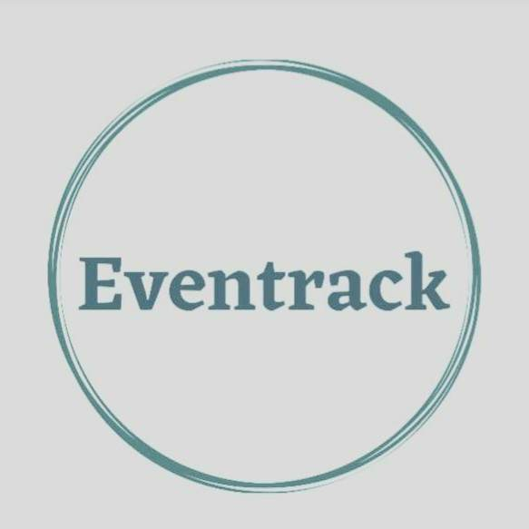
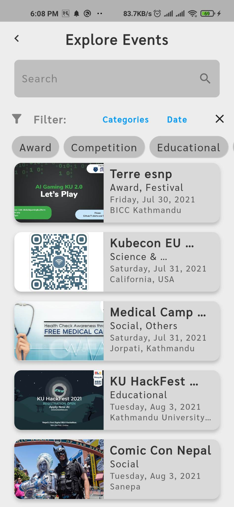

<h1 align="center">
 
</h1>
<h4 align="center"><b> EventTrack -One stop solution for events!</b></h4>
<div align="center">

</div>

## About ℹ️ 

EventTrack is a Flutter based mobile app to find nearby events, register and manage their events. Designed for both attendees and event organizers, EventTrack provides a complete suite of features for everyone.

## Key Features 🧑‍💻

- Search nearby events based on categories and timelines
- Authentication and Role Based Access Control for attendees, organizers and admins
- Register to the events directly from the app
- Full CRUD operations to manage events (for verified organizers)
- Used MapBox library to geolocate event address and integrating maps 

## Run Locally (Development Environment) ⚒️

#### Clone the repository and navigate to the project root directory. Make sure you have [Flutter](https://docs.flutter.dev/get-started/install) installed on your machine.

*Note: The application depends on server made with ExpressJS. Find the source code [here]() and make sure its running before you run this Flutter app.*

```bash
# Get packages
$ flutter pub get
```

```bash
# Run the applicaton
$ flutter run
```

```bash
# To build apk and ios bundle:
$ flutter build
```

## Tech Used 💻

- Frontend : Flutter
- State Management: GetX
- Database : MongoDB
- Authentication : Google Auth
- Location Services and Geopointing : MapBox
- File Storage : Cloudinary
- Backend : ExpressJS (NodeJS)

  
## Screenshots 

<div align="center">
  
  
  
  
  
  
</div>

## Contributions

Contributions are highly appreciated. Please send a Pull Request with suggested changes or open an Issue to get things started!
